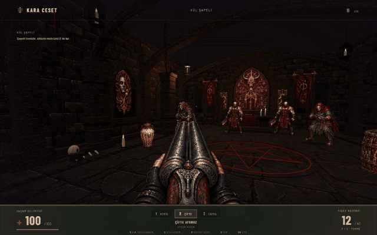
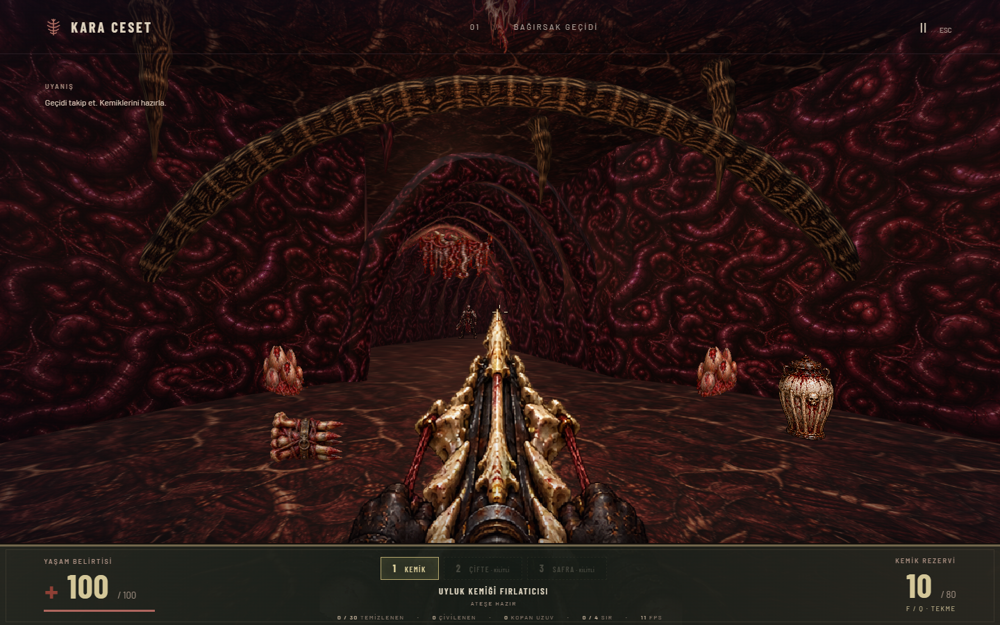
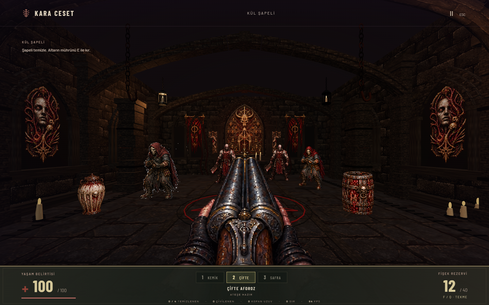

# KARA CESET

**Kül Ayini. Yeryüzü et oldu. Ölüler geri döndü.**

Tarayıcıda oynanan karanlık bir FPS. Yaşayan organik geçitlere in, tarikat üyeleriyle çatış, mühürleri bul ve ayini parçala.

**Yaratıcı ve proje sahibi: [torunum](https://github.com/torunum).**



## Oyunun İçinde

- **Bağırsak Geçidi:** bağlantılı odalar, iki mühür, dört gizli geçit ve açılmayı bekleyen organik kapılar.
- **Kül Şapeli:** dört düşman, çift namlulu ile başlayan kısa bir karşılaşma, altar mührü ve demir kapı.
- **Üç silah:** kemik fırlatıcısı, çift namlulu ve asit bezi. Ana bölümde çifte ve asit silahını keşfederek açarsın.
- **Yakın ve sert çatışma:** tekme, duvara çivileme, bölgesel hasar, kopan uzuvlar ve kırılabilir çevre.
- **Kolay / Normal / Zor:** ana bölümün düşman sayısı, tepki süreleri ve kaynakları seçimine göre değişir.

| Bağırsak Geçidi | Kül Şapeli |
| --- | --- |
|  |  |

## Çalıştırma

Node.js **20.19+ veya 22.12+**, npm ve WebGL2 destekli masaüstü tarayıcı gerekir.

```sh
git clone https://github.com/torunum/karaceset.git
cd karaceset
npm install
npm run dev
```

[Oyunu aç](http://127.0.0.1:5173/). Kül Şapeli'ne menüdeki bağlantıdan veya [`?chapel=1`](http://127.0.0.1:5173/?chapel=1) adresinden gir. Yazı tipleri, dokular ve sesler yereldir.

```sh
npm test
npm run build
npm run preview
```

Üretim dosyaları `dist/` altında oluşur; bu klasörü bir HTTP sunucusuyla sun. Önizleme adresi varsayılan olarak [127.0.0.1:4173](http://127.0.0.1:4173/).

## Kontroller

| Girdi | İşlev |
| --- | --- |
| WASD | Hareket |
| Fare | Bakış |
| Sol tık / basılı tut | Ateş |
| 1 / 2 / 3 | Kemik / çifte / asit |
| F veya Q | Tekme |
| E | Etkileşim |
| Escape | Duraklat |
| Ok tuşları | Alternatif bakış |

Fare kilidi desteklenmiyorsa sağ tuşla sürükleyerek bak. Ses, hassasiyet ve görüntü kalitesi menüde ayarlanır.

## Kapsam

Three.js ve TypeScript ile geliştirilmiştir. Ana bölüm ve ayrı şapel karşılaşması içerir; mobil kontrol ve checkpoint yoktur. Yoğun korku, kan ve parçalanma görüntüleri içerir.

Ana bölümde İlik Mührü sinir düğümünü, Safra Mührü çıkışı açan ilerleyişin parçasıdır. Çıkış için kapının açılması ve son bölgenin muhafızlarının temizlenmesi gerekir; bütün haritadaki düşmanları öldürmek zorunlu değildir.

## Haklar ve Kaynaklar

© 2026 torunum. Projeye ait özgün içerik için tüm hakları saklıdır; paket lisansı `UNLICENSED` olarak belirtilmiştir. Üçüncü taraf bileşenler kendi lisanslarına tabidir.

[Varlık kaynakları](docs/ASSETS.md) · [Ses kaynakları ve katkı sahipleri](docs/AUDIO-SOURCES.md) · [Üçüncü taraf lisans bildirimleri](docs/promo/THIRD_PARTY_NOTICES.md)

Three.js ve polygon-clipping MIT, Barlow yazı tipleri SIL OFL 1.1 lisanslıdır. Ses kayıtlarının kaynakları CC0 olarak belgelenmiştir. İlgili telif ve lisans metinleri korunur.
